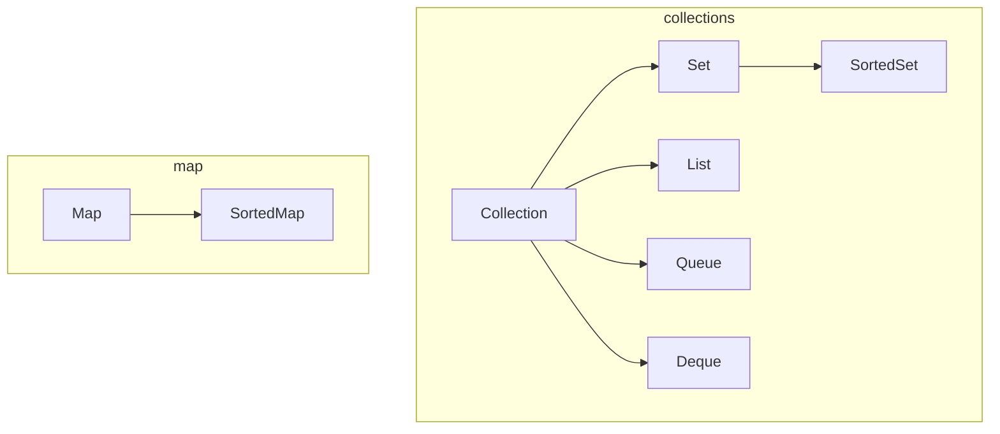

# Java

## Controlling Access to Members of a Class

> refer to https://docs.oracle.com/javase/tutorial/java/javaOO/accesscontrol.html

Access level modifiers determine whether other classes can use a particular field or invoke a particular method. There are two levels of access control:

+ At the top level—public, or package-private (no explicit modifier).

+ At the member level—public, private, protected, or package-private (no explicit modifier).

A class may be declared with the modifier public, in which case that class is visible to all classes everywhere. If a class has no modifier (the default, also known as package-private), it is visible only within its own package (packages are named groups of related classes — you will learn about them in a later lesson.)

At the member level, you can also use the public modifier or no modifier (package-private) just as with top-level classes, and with the same meaning. For members, there are two additional access modifiers: private and protected. The private modifier specifies that the member can only be accessed in its own class. The protected modifier specifies that the member can only be accessed within its own package (as with package-private) and, in addition, by a subclass of its class in another package.

The following table shows the access to members permitted by each modifier.

|  Modifier   | Class | Package | Subclass | World |
| :---------: | :---: | :-----: | :------: | :---: |
|   public    |   Y   |    Y    |    Y     |   Y   |
|  protected  |   Y   |    Y    |    Y     |   N   |
| no modifier |   Y   |    Y    |    N     |   N   |
|   private   |   Y   |    N    |    N     |   N   |

## Java Collections Framework

### **Interfaces**

> refer to https://docs.oracle.com/javase/tutorial/collections/interfaces/index.html

The core collection interfaces encapsulate different types of collections, which are shown in the figure below. These interfaces allow collections to be manipulated independently of the details of their representation. Core collection interfaces are the foundation of the Java Collections Framework. As you can see in the following figure, the core collection interfaces form a hierarchy.

The following list describes the core collection interfaces:

  + Collection — the root of the collection hierarchy. A collection represents a group of objects known as its elements. The Collection interface is the least common denominator that all collections implement and is used to pass collections around and to manipulate them when maximum generality is desired. Some types of collections allow duplicate elements, and others do not. Some are ordered and others are unordered. The Java platform doesn't provide any direct implementations of this interface but provides implementations of more specific subinterfaces, such as Set and List. Also see The Collection Interface section.

  + Set — a collection that cannot contain duplicate elements. This interface models the mathematical set abstraction and is used to represent sets, such as the cards comprising a poker hand, the courses making up a student's schedule, or the processes running on a machine. See also The Set Interface section.

  + List — an ordered collection (sometimes called a sequence). Lists can contain duplicate elements. The user of a List generally has precise control over where in the list each element is inserted and can access elements by their integer index (position). If you've used Vector, you're familiar with the general flavor of List. Also see The List Interface section.

  + Queue — a collection used to hold multiple elements prior to processing. Besides basic Collection operations, a Queue provides additional insertion, extraction, and inspection operations.

    Queues typically, but do not necessarily, order elements in a FIFO (first-in, first-out) manner. Among the exceptions are priority queues, which order elements according to a supplied comparator or the elements' natural ordering. Whatever the ordering used, the head of the queue is the element that would be removed by a call to remove or poll. In a FIFO queue, all new elements are inserted at the tail of the queue. Other kinds of queues may use different placement rules. Every Queue implementation must specify its ordering properties. Also see The Queue Interface section.

  + Deque — a collection used to hold multiple elements prior to processing. Besides basic Collection operations, a Deque provides additional insertion, extraction, and inspection operations.

    Deques can be used both as FIFO (first-in, first-out) and LIFO (last-in, first-out). In a deque all new elements can be inserted, retrieved and removed at both ends. Also see The Deque Interface section.

  + Map — an object that maps keys to values. A Map cannot contain duplicate keys; each key can map to at most one value. If you've used Hashtable, you're already familiar with the basics of Map. Also see The Map Interface section.

The last two core collection interfaces are merely sorted versions of Set and Map:

  + SortedSet — a Set that maintains its elements in ascending order. Several additional operations are provided to take advantage of the ordering. Sorted sets are used for naturally ordered sets, such as word lists and membership rolls. Also see The SortedSet Interface section.
  
  + SortedMap — a Map that maintains its mappings in ascending key order. This is the Map analog of SortedSet. Sorted maps are used for naturally ordered collections of key/value pairs, such as dictionaries and telephone directories. Also see The SortedMap Interface section.

### **Implementations**

> refer to https://docs.oracle.com/javase/tutorial/collections/implementations/index.html

The general-purpose implementations are summarized in the following table.

| Interfaces | Hash table | Resizable array |  Tree   | Linked list | Hash table + Linked list |
| :--------: | :--------: | :-------------: | :-----: | :---------: | :----------------------: |
|    Set     |  HashSet   |                 | TreeSet |             |      LinkedHashSet       |
|    List    |            |    ArrayList    |         | LinkedList  |                          |
|   Queue    |            |                 |         |             |                          |
|   Deque    |            |   ArrayDeque    |         | LinkedList  |                          |
|    Map     |  HashMap   |                 | TreeMap |             |      LinkedHashMap       |

As you can see from the table, the Java Collections Framework provides several general-purpose implementations of the Set, List , and Map interfaces. In each case, one implementation — HashSet, ArrayList, and HashMap — is clearly the one to use for most applications, all other things being equal. Note that the SortedSet and the SortedMap interfaces do not have rows in the table. Each of those interfaces has one implementation (TreeSet and TreeMap) and is listed in the Set and the Map rows. There are two general-purpose Queue implementations — LinkedList, which is also a List implementation, and PriorityQueue, which is omitted from the table. These two implementations provide very different semantics: LinkedList provides FIFO semantics, while PriorityQueue orders its elements according to their values.

Each of the general-purpose implementations provides all optional operations contained in its interface. **All permit null elements, keys, and values. None are synchronized (thread-safe).** All have fail-fast iterators, which detect illegal concurrent modification during iteration and fail quickly and cleanly rather than risking arbitrary, nondeterministic behavior at an undetermined time in the future. All are Serializable and all support a public clone method.

The fact that these implementations are unsynchronized represents a break with the past: The legacy collections Vector and Hashtable are synchronized. The present approach was taken because collections are frequently used when the synchronization is of no benefit. Such uses include single-threaded use, read-only use, and use as part of a larger data object that does its own synchronization. In general, it is good API design practice not to make users pay for a feature they don't use. Furthermore, unnecessary synchronization can result in deadlock under certain circumstances.

If you need thread-safe collections, the synchronization wrappers, described in the Wrapper Implementations section, allow any collection to be transformed into a synchronized collection. Thus, synchronization is optional for general-purpose implementations, whereas it is mandatory for legacy implementations. Moreover, the java.util.concurrent package provides concurrent implementations of the BlockingQueue interface, which extends Queue, and of the ConcurrentMap interface, which extends Map. These implementations offer much higher concurrency than mere synchronized implementations.

# Redis
